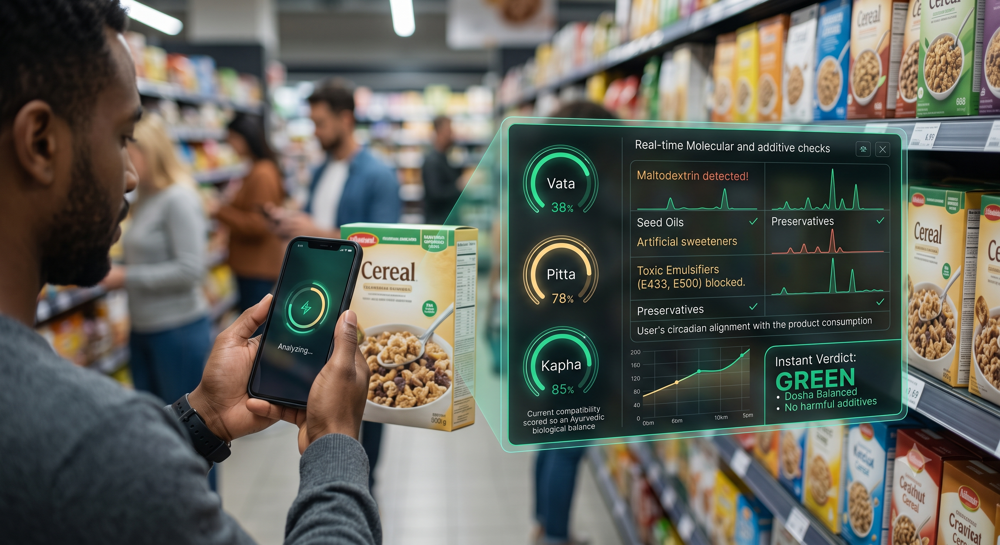

<div align="center">

# 🌿 Aahaar AI

### Ancient Wisdom Meets Algorithmic Nutrition.

**AI-native nutrition platform fusing 5,000 years of Ayurvedic science with real-time computer vision, biometric intelligence, and circadian biology.**

[](https://nextjs.org)
[](https://react.dev)
[](https://www.typescriptlang.org)
[](https://threejs.org)
[](https://tailwindcss.com)

[🌐 Live Site](https://aahaar.ai) · [📋 Join Waitlist](https://aahaar.ai/#waitlist)

</div>

---

## 📸 Preview



---

## 🧠 What is Aahaar AI?

Aahaar AI is a **next-generation, AI-native nutrition intelligence platform** that eliminates the friction of traditional calorie tracking. Instead of manual food logging, users simply **point their camera at any meal** — and the AI instantly decomposes it into molecular constituents, cross-references 5,000-year-old Ayurvedic Dosha science, and generates hyper-personalized dietary guidance synchronized to their real-time biometrics.

> *"Say goodbye to exhausting calorie tracking. Point your camera. Get the truth."*

With **1,420+ early access signups** before public launch, Aahaar AI is building at the intersection of ancient bio-individuality wisdom and frontier AI.

---

## ✨ Core Features

### 🔬 Neural Vision Scanner — *Molecular Truth in Under 200ms*
- Multimodal food decomposition model trained on **2.4M+ culinary preparations**
- Decomposes composite dishes, gravies, and salads into discrete raw ingredients with gram-weight approximations
- **99.4% ingredient detection accuracy** — no barcodes, no manual input required
- Screens for hidden seed oils, synthetic emulsifiers, and ultra-processed food additives
- Forecasts post-prandial blood sugar spikes via fiber-to-carb ratio analysis

### 🔥 Dosha Engine — *5,000-Year Wisdom, Re-Engineered by AI*
- Interactive **Ayurvedic Prakriti (bio-constitution) profiling** — Pitta, Vata, Kapha
- Dynamically harmonizes metabolic constitution with solar circadian cycles (Dinacharya)
- AI recommendations per Dosha (cooling foods for Pitta, grounding meals for Vata, light dishes for Kapha)
- Aligns heavy macronutrient intake with **solar noon Jatharagni (digestive fire)** peak — **4.2x enhanced digestive efficiency**

### 💓 Biometric Intelligence — *Synchronized to Your Biological Clock*
- Real-time wearable ecosystem sync: **Apple Health, WHOOP, Oura Ring, Garmin, CGM**
- Metabolic flexibility mapping — tracks fat vs. carb oxidation throughout the day
- Nutrient timing algorithm for optimal pre/post-workout recovery windows
- Dynamic macro splits shift **daily** based on HRV, sleep depth, and muscular strain — **+38% greater long-term adherence**

### 🛡️ Purity Guard — *100% Ingredient Transparency*
- Automated micro-toxin screening for synthetic emulsifiers, microplastics, HFCS, and bio-contaminants
- Identifies inflammatory industrial seed oils (canola, soybean, cottonseed) in packaged goods before purchase
- Real-time purity score per item before it enters your pantry

---

## 🏗️ Project Architecture

```
aahaar-ai/
├── src/
│   ├── app/
│   │   ├── api/
│   │   │   └── waitlist/            # Edge API route — waitlist submission handler
│   │   ├── globals.css              # Design tokens, custom utilities, CSS variables
│   │   ├── layout.tsx               # Root layout — metadata, fonts, Sonner toaster
│   │   └── page.tsx                 # Orchestrates all page sections
│   ├── components/
│   │   ├── canvas/                  # Three.js / React Three Fiber 3D scenes
│   │   │   ├── AwakeningScene.tsx
│   │   │   ├── LaunchScene.tsx
│   │   │   ├── Particles.tsx
│   │   │   ├── ResultScene.tsx
│   │   │   ├── SeedScene.tsx
│   │   │   └── VerdictScene.tsx
│   │   ├── dom/                     # Complex DOM components (cards, overlays)
│   │   │   ├── HeroCard.tsx
│   │   │   └── WaitlistCard.tsx
│   │   ├── providers/               # React context providers
│   │   │   └── ReducedMotionProvider.tsx
│   │   ├── sections/                # Full-page landing sections
│   │   │   ├── Navbar.tsx
│   │   │   ├── HeroSection.tsx
│   │   │   ├── VisionScannerSection.tsx
│   │   │   ├── DoshaEngineSection.tsx
│   │   │   ├── BiometricSection.tsx
│   │   │   ├── BentoSection.tsx
│   │   │   ├── WaitlistSection.tsx
│   │   │   └── Footer.tsx
│   │   └── ui/                      # Atomic, reusable UI primitives
│   │       └── WaitlistForm.tsx
│   ├── hooks/                       # Custom React hooks
│   └── lib/                         # Utilities, helpers, constants
├── public/                          # Static assets, images, OG metadata image
├── next.config.ts
└── tsconfig.json
```

---

## 🛠️ Tech Stack

| Layer | Technology | Why |
|---|---|---|
| **Framework** | Next.js 16 (App Router) | Edge-ready, RSC-first, best-in-class DX |
| **UI Library** | React 19 | Concurrent features, use() hook, optimistic updates |
| **Language** | TypeScript 5 | Full type safety across all layers |
| **3D / WebGL** | Three.js + React Three Fiber + Drei | Declarative 3D particle scenes with post-processing |
| **Animation** | Framer Motion 13 + GSAP 3 | Scroll-triggered reveals + timeline orchestration |
| **Styling** | Tailwind CSS v4 | JIT, arbitrary values, CSS variable design tokens |
| **Forms** | React Hook Form + Zod v4 | Schema-validated forms with zero unnecessary re-renders |
| **Notifications** | Sonner | Glassmorphic, accessible toast notifications |
| **Icons** | Lucide React | Consistent, tree-shakeable SVG icon set |
| **Post-processing** | @react-three/postprocessing | Bloom, DoF, and vignette shaders on WebGL scenes |

---

## 🎨 Design System

Built on a curated **dark-mode, biopunk design language**:

- **Color Palette:** Emerald `#10b981` × Teal `#14b8a6` × Amber `#f59e0b`
- **Background:** `#06090e` — deep near-black with subtle cool blue tint
- **Glassmorphism:** `backdrop-blur-xl` + `bg-white/[0.04]` + `border-white/[0.08]`
- **Typography:** `Space Grotesk 700` (headings) + `Inter 300/400/500` (body)
- **Motion:** `whileInView` scroll reveals, `animate-pulse` live indicators, GSAP timelines
- **Accessibility:** Global `ReducedMotionProvider` respects `prefers-reduced-motion`

---

## 🚀 Getting Started

### Prerequisites

- **Node.js** ≥ 20.x
- **npm** ≥ 10.x

### Installation

```bash
# 1. Clone the repository
git clone https://github.com/OmkarDeshmukh16/Aahaar.ai.git
cd Aahaar.ai

# 2. Install dependencies
npm install

# 3. Set up environment variables
cp .env.example .env.local
# Edit .env.local with your values

# 4. Start the development server
npm run dev
```

Open [http://localhost:3000](http://localhost:3000) — the app hot-reloads on save.

### Scripts

| Command | Description |
|---|---|
| `npm run dev` | Start development server (Turbopack) |
| `npm run build` | Build production bundle |
| `npm run start` | Start production server |
| `npm run lint` | Run ESLint across the codebase |

---

## 🔐 Environment Variables

```env
# .env.local

# Waitlist API / CRM webhook endpoint
WAITLIST_API_URL=

# Site base URL (for OG metadata)
NEXT_PUBLIC_SITE_URL=https://aahaar.ai
```

> `.env.local` is listed in `.gitignore` and should never be committed.

---

## 🔌 API Reference

### `POST /api/waitlist`

Handles waitlist submissions from hero and dedicated waitlist sections.

**Request Body**
```json
{
  "email": "user@example.com",
  "goal": "Ayurvedic Balance"
}
```

`goal` is optional and only sent from the `detailed` form variant. Accepted values:
`Ayurvedic Balance` · `Fat Loss & Agni Boost` · `Lean Muscle Hypertrophy` · `Gut Microbiome Health` · `Metabolic Longevity`

**Responses**

| Status | Meaning |
|---|---|
| `200 OK` | Successfully added to waitlist |
| `400 Bad Request` | Invalid or missing email |
| `409 Conflict` | Email already registered |
| `500 Internal Server Error` | Upstream service failure |

---

## 🧩 Component Architecture

Strict separation of concerns across four component layers:

```
sections/   →  Full-width page sections (layout composition + data ownership)
dom/        →  Complex DOM components (interactive cards, overlays)
canvas/     →  Three.js/R3F WebGL scenes (isolated from DOM tree)
ui/         →  Atomic, reusable UI primitives (forms, buttons, inputs)
providers/  →  React context (motion preferences, accessibility state)
```

All 3D canvas scenes are **lazy-composed** inside sections and isolated from the DOM tree to prevent layout thrashing and enable independent Suspense boundaries.

---

## ⚙️ Engineering Highlights

- **React 19 + Next.js 16 App Router** — Bleeding-edge RSC model for optimal TTFB and streaming
- **WebGL Post-Processing Pipeline** — Custom bloom + vignette shader passes via `@react-three/postprocessing`
- **Reduced Motion Accessibility** — `ReducedMotionProvider` globally disables GSAP/Framer animations for users with vestibular disorders
- **Zod v4 Schema Validation** — All form submissions are validated end-to-end before reaching the API route
- **Full SEO Coverage** — `metadataBase`, Open Graph, and Twitter card metadata configured at the root layout level
- **Zero Calorie-Counting UX** — The entire interaction model is built around camera-first, frictionless food logging

---

## 🗺️ Roadmap

- [ ] **Mobile App (iOS / Android)** — React Native port with camera-first experience
- [ ] **Live Vision Scanner** — Real-time camera stream with AR nutrition overlay
- [ ] **Dosha Questionnaire Onboarding** — Multi-step Prakriti assessment flow
- [ ] **Wearable SDK Integration** — Apple HealthKit, Google Fit, WHOOP API connectors
- [ ] **Grocery Scan Mode** — Barcode fallback + packaged food purity scoring
- [ ] **Meal Planning Engine** — Weekly Dinacharya-aligned meal planner with shopping list export
- [ ] **Community & Social Layer** — Shared meal logs and Dosha-based community groups

---

## 🤝 Contributing

This is a **private repository** in closed development. Contributions are by invitation only.

Interested in collaborating? Reach out via the [waitlist](https://aahaar.ai/#waitlist) or open a GitHub Discussion.

---

## 📄 License

Proprietary and confidential. Unauthorized copying, distribution, or use is strictly prohibited.

---

<div align="center">

Built with ❤️ by **Omkar Deshmukh**

[aahaar.ai](https://aahaar.ai) · *Ancient wisdom. Algorithmic precision. One platform.*

</div>
